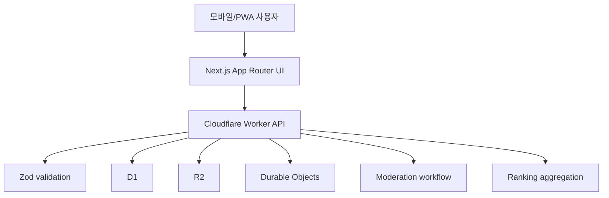

# #실시간 아키텍처 설계

## 프로젝트 개요

- 프로젝트명: `#실시간`
- 설명: 사용자가 전국 장소의 실시간 혼잡도, 댓글, 사진, 좋아요, 신고 상태를 확인하고 현장 정보를 보탤 수 있는 위치 기반 장소 앱.
- 타깃 사용자: 여행지/맛집/병원/관공서/주차장 방문 직전 현재 상태를 알고 싶은 사용자와 현장 정보를 가볍게 제보하는 사용자.
- 프로젝트 규모: 전국 MVP.

## 기능 요구사항

| # | 기능 | 설명 | 우선순위 |
| --- | --- | --- | --- |
| FR-1 | 내 주변 보기 | 현재 위치 기준 주변 장소의 활성 제보와 질문을 본다. | P0 |
| FR-2 | 장소 검색/상세 | 장소별 현재 혼잡도, 줄, 주차, 날씨, 사진, 질문을 본다. | P0 |
| FR-3 | 현장 제보 | 사진, 상태 선택, 한 줄 코멘트, 위치 인증으로 제보한다. | P0 |
| FR-4 | 위치 인증 | 서버에서 장소와의 거리를 계산하고 원좌표 대신 거리 구간만 저장한다. | P0 |
| FR-5 | 댓글 작성 | 장소별 현장 코멘트를 익명 식별자 기준으로 작성한다. | P0 |
| FR-6 | 랭킹 | 전국/지역/카테고리/지도 영역 기준 실시간 인기 장소를 제공한다. | P0 |
| FR-7 | 3시간 만료 | 제보는 3시간 이후 기본 피드와 지도에서 제외한다. | P0 |
| FR-8 | 신고/숨김 | 허위, 광고, 얼굴, 차량번호, 민감정보 신고를 접수하고 기준 충족 시 숨긴다. | P0 |
| FR-9 | 민감 카테고리 경고 | 병원/관공서에서는 업로드 전 민감정보 경고와 제한 문구를 표시한다. | P0 |
| FR-10 | 공유 카드 | 카카오톡/인스타/쓰레드 공유 카드용 메타 정보를 제공한다. | P1 |

## 비기능 요구사항

| # | 항목 | 요구사항 |
| --- | --- | --- |
| NFR-1 | 개인정보 | 사용자 정확 좌표, 사진 GPS EXIF, 민감정보가 저장/노출되지 않아야 한다. |
| NFR-2 | 보안 | Cloudflare Worker API 입력 검증, D1/R2 직접 접근 금지, 비밀키 서버 전용 보관. |
| NFR-3 | 성능 | 모바일 첫 화면은 정적/캐시 가능한 데이터 중심으로 빠르게 렌더링한다. |
| NFR-4 | 운영 | 신고/숨김/삭제 SLA와 감사 로그를 준비한다. |
| NFR-5 | 법무 | 위치기반서비스 신고 가능성과 개인정보 처리방침을 MVP 단계부터 점검한다. |

## 기술 스택

| 구분 | 기술 | 선택 근거 |
| --- | --- | --- |
| 프론트엔드 | Next.js App Router, React, TypeScript | PWA와 지도 중심 UI를 빠르게 검증한다. |
| UI | CSS Modules + 기능 컴포넌트 | 전국 지도, 랭킹, 장소 상세을 한 화면에서 안정적으로 구성한다. |
| 백엔드 | Cloudflare Workers | 전국 트래픽을 낮은 비용과 짧은 지연으로 처리한다. |
| DB/Auth/Storage | D1, R2, Durable Objects, 익명 식별자 | 장소/이벤트 저장, 사진 저장, 실시간 방 관리를 Cloudflare 안에서 처리한다. |
| 검증 | Zod, node:test, ESLint, TypeScript | 입력 검증과 회귀 테스트를 최소 의존성으로 유지한다. |

## 시스템 구조


```mermaid
flowchart TD
  U["모바일/PWA 사용자"] --> W["Next.js App Router UI"]
  W --> A["Cloudflare Worker API"]
  A --> V["Zod validation"]
  A --> D["D1"]
  A --> S["R2"]
  A --> O["Durable Objects"]
  A --> M["Moderation workflow"]
  A --> C["Ranking aggregation"]
```

## 데이터/위치 원칙

- 클라이언트는 인증 순간에만 좌표를 API에 보낸다.
- 서버는 장소 좌표와 비교해 `50m`, `150m`, `300m` 거리 구간만 산출한다.
- DB에는 사용자 원본 위도/경도, 이동 경로, 사진 EXIF GPS를 저장하지 않는다.
- 공개 응답에는 장소 기준 상태와 `verified_radius_m`만 포함한다.
- 위치정보지원센터 안내상 개인위치정보를 사업자 시스템으로 전송하는 위치기반서비스는 신고 대상이 될 수 있고, 단말기 내부에서만 활용하며 사업자 시스템으로 전송하지 않는 경우는 신고 대상 제외 사례로 안내되어 있다. MVP는 신고 리스크를 줄이기 위해 원좌표 저장을 금지한다.

## 디렉터리 구조

```txt
silsigan/
  src/app/
    api/
    layout.tsx
    page.tsx
  src/components/silsigan/
  src/lib/
  workers/api/
    migrations/
  tests/
  docs/
  _workspace/
```

## 팀 전달 사항

- 프론트엔드: 한 페이지 탭형 PWA 프로토타입으로 홈/지도/상세/제보/질문/마이를 제공한다.
- 백엔드: 모든 쓰기는 Cloudflare Worker를 거쳐 검증하고, D1/R2 직접 접근은 서버 바인딩으로만 수행한다.
- 실시간: Worker는 댓글/사진/신고 이벤트를 Durable Object place/region/global room으로 fanout하고, DO binding이 없으면 polling fallback을 제공한다.
- QA: 위치 원본 미저장, 3시간 만료, 신고 숨김, 좋아요/댓글/사진 negative-path를 우선 검증한다.
- DevOps: Cloudflare API 토큰과 관리자 토큰은 로컬/CI secret으로만 등록하고 브라우저 번들에 노출하지 않는다.

## MVP 제외

결제, 현금성 포인트, DM, 팔로우, 업체 광고, 네이티브 앱, AI 자동 판독.
