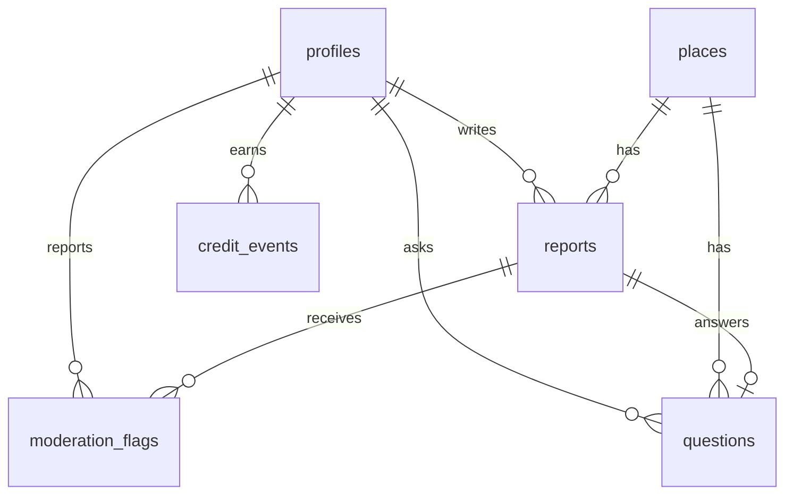

# #실시간 DB 스키마

## ERD

## 테이블 정의

### profiles

| 컬럼 | 타입 | 설명 |
| --- | --- | --- |
| `id` | uuid | `auth.users(id)` 참조 |
| `display_name` | text | 닉네임 |
| `trust_score` | integer | 신뢰도 점수 |
| `created_at` | timestamptz | 생성일 |

### places

| 컬럼 | 타입 | 설명 |
| --- | --- | --- |
| `id` | uuid | 장소 ID |
| `name` | text | 장소명 |
| `address` | text | 주소 |
| `region` | enum | `ulsan`, `busan`, `gyeongju` |
| `category` | enum | 관광지, 축제, 맛집/카페, 병원, 관공서, 주차장 |
| `latitude`, `longitude` | numeric | 장소 좌표. 사용자 좌표가 아니다. |

### reports

| 컬럼 | 타입 | 설명 |
| --- | --- | --- |
| `place_id` | uuid | 장소 |
| `user_id` | uuid | 작성자 |
| `crowd_level` | enum | 혼잡도 |
| `line_status` | enum | 줄 상태 |
| `parking_status` | enum | 주차 상태 |
| `weather_feel` | enum | 체감 날씨 |
| `comment` | text | 120자 이하 |
| `photo_path` | text | EXIF 제거/재인코딩 후 저장된 경로 |
| `verified_radius_m` | smallint | `50`, `150`, `300` 중 하나 |
| `expires_at` | timestamptz | 기본 `created_at + 3 hours` |
| `hidden_at` | timestamptz | 신고/운영 숨김 |

### questions

| 컬럼 | 타입 | 설명 |
| --- | --- | --- |
| `place_id` | uuid | 질문 장소 |
| `user_id` | uuid | 질문자 |
| `question_type` | enum | 혼잡도/줄/주차/날씨/사진요청/기타 |
| `body` | text | 4~160자 |
| `credit_cost` | smallint | 일반 1, 사진 요청 2 |
| `answered_report_id` | uuid | 답변에 연결된 제보 |

### credit_events

질문권은 잔액 컬럼보다 원장 방식으로 추적한다. 운영에서는 서버 API 또는 DB 함수만 insert한다.

| 이벤트 | 금액 |
| --- | ---: |
| `signup_bonus` | +3 |
| `verified_report` | +1 |
| `photo_report` | +1 |
| `answer_question` | +2 |
| `ask_question` | -1 |
| `ask_photo_request` | -2 |
| `confirmed_false_report` | -5 |

### moderation_flags

| 컬럼 | 타입 | 설명 |
| --- | --- | --- |
| `report_id` | uuid | 신고 대상 제보 |
| `reporter_id` | uuid | 신고자 |
| `reason` | enum | 허위/광고/얼굴/차량번호/민감정보/기타 |
| `note` | text | 200자 이하 |

## RLS 전략

- 모든 테이블 `enable row level security`.
- 공개 읽기는 `places`, 만료 전/숨김 전 `reports`, 장소별 `questions`만 허용한다.
- `credit_events`는 본인 읽기만 허용하고 클라이언트 직접 insert는 허용하지 않는다.
- `reports`, `questions`, `moderation_flags` 쓰기는 운영에서 서버 API/service role 또는 보안 함수로만 처리한다.
- 사용자 원본 좌표 컬럼은 만들지 않는다.

## 인덱스 전략

| 테이블 | 인덱스 | 용도 |
| --- | --- | --- |
| `places` | `(region, category)` | 지역/카테고리 필터 |
| `reports` | `(place_id, created_at desc)` | 장소 상세 최근 제보 |
| `reports` | partial `(expires_at, hidden_at)` | 활성 제보 조회 |
| `questions` | `(place_id, created_at desc)` | 장소 질문 |
| `credit_events` | `(user_id, created_at desc)` | 잔액 계산 |
| `moderation_flags` | `(report_id, reason)` | 숨김 기준 계산 |
