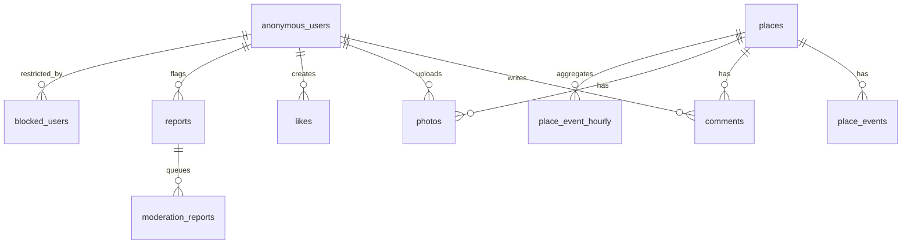

# #실시간 DB 스키마

## ERD

```mermaid
erDiagram
  anonymous_users ||--o{ comments : writes
  anonymous_users ||--o{ photos : uploads
  anonymous_users ||--o{ likes : creates
  anonymous_users ||--o{ reports : flags
  anonymous_users ||--o{ blocked_users : restricted_by
  reports ||--o{ moderation_reports : queues
  places ||--o{ place_events : has
  places ||--o{ comments : has
  places ||--o{ photos : has
  places ||--o{ place_event_hourly : aggregates
```

## 테이블 정의

### anonymous_users

| 컬럼 | 타입 | 설명 |
| --- | --- | --- |
| `id` | text | 익명 식별자 해시 |
| `region_code` | text | 마지막 coarse 지역 |
| `trust_score` | integer | 신뢰도 점수 |
| `created_at` | timestamptz | 생성일 |

### places

| 컬럼 | 타입 | 설명 |
| --- | --- | --- |
| `id` | uuid | 장소 ID |
| `name` | text | 장소명 |
| `address` | text | 주소 |
| `region_code` | text | 전국 시도 코드 |
| `area_code` | text | 시군구/권역 코드 |
| `category` | enum | 관광지, 축제, 맛집/카페, 병원, 관공서, 주차장 |
| `latitude`, `longitude` | numeric nullable | 장소 좌표. 사용자 좌표가 아니며, 좌표 미검증이면 null |
| `coordinate_status` | text | `verified`, `TODO_COORDINATE_VERIFY`, `rejected` |

### place_events

현장 제보, 댓글, 사진, 좋아요, 클릭의 최근 3시간 실시간 신호를 저장한다. 공개 `GET /api/reports`는 이 테이블에서 `event_type = 'report'` 및 `source = 'field_report'`만 읽는다.

| 컬럼 | 타입 | 설명 |
| --- | --- | --- |
| `id` | text | 이벤트 ID. 현장 제보는 `field_report_...` |
| `place_id` | text | 장소 |
| `anonymous_user_id` | text | 작성자 익명 사용자 해시 |
| `event_type` | text | `report`, `comment`, `photo`, `like`, `click` |
| `source` | text | 일반 Worker 이벤트는 `worker_api`, 현장 제보는 `field_report` |
| `region_code`, `area_code`, `category` | text | 랭킹/목록 필터 키 |
| `crowd_level` | enum nullable | 현장 제보 혼잡도 |
| `line_status` | enum nullable | 현장 제보 줄 상태 |
| `parking_status` | enum nullable | 현장 제보 주차 상태 |
| `verified_radius_m` | smallint | `50`, `150`, `300` 중 하나 |
| `created_at` | text | 생성 시각 |
| `expires_at` | text nullable | 실시간 신호 만료 시각. 현장 제보는 기본 `created_at + 3 hours` |

`weather_feel`, `comment`, `photoUrl`, 사용자 원좌표는 `place_events`에 저장하지 않는다. 현재 D1 목록 응답도 이 이유로 `weatherFeel`을 포함하지 않는다.

### comments

| 컬럼 | 타입 | 설명 |
| --- | --- | --- |
| `place_id` | uuid | 댓글 장소 |
| `anon_id_hash` | text | 작성자 익명 식별자 해시 |
| `body` | text | 2~280자 |
| `status` | text | active/hidden/deleted |
| `report_count` | integer | 누적 신고 수 |
| `deleted_at` | timestamptz | 작성자/운영 삭제 |

### photos

| 컬럼 | 타입 | 설명 |
| --- | --- | --- |
| `place_id` | uuid | 사진 장소 |
| `anon_id_hash` | text | 업로더 익명 식별자 해시 |
| `r2_key` | text | R2 저장 경로 |
| `public_url` | text | 공개 또는 서명 URL |
| `image_hash` | text | 정화/재인코딩 후 최종 이미지 SHA-256 fingerprint. public/R2 metadata 미노출 |
| `duplicate_status` | text | unchecked/unique |
| `status` | text | pending/active/hidden/deleted |
| `report_count` | integer | 누적 신고 수 |
| `deleted_at` | timestamptz | 삭제 시각 |

### place_event_hourly

| 컬럼 | 타입 | 설명 |
| --- | --- | --- |
| `place_id` | uuid | 장소 |
| `bucket_hour` | timestamptz | 집계 시간 |
| `region_code`, `area_code`, `category` | text | 랭킹 필터 키 |
| `click_count`, `like_count`, `comment_count`, `photo_count`, `report_count` | integer | 이벤트 집계 |
| `unique_user_count` | integer | 같은 장소/시간 버킷의 `place_events.anonymous_user_id` distinct 기준 유니크 수 |

### moderation_reports

| 컬럼 | 타입 | 설명 |
| --- | --- | --- |
| `target_type` | text | place/comment/photo |
| `target_id` | uuid | 신고 대상 |
| `anon_id_hash` | text | 신고자 익명 식별자 해시 |
| `reason` | enum | 허위/광고/얼굴/차량번호/민감정보/기타 |
| `note` | text | 200자 이하 |

### reports

운영 신고 큐의 원천 테이블이다. 현장 상태 제보 목록과 섞지 않는다.

| 컬럼 | 타입 | 설명 |
| --- | --- | --- |
| `id` | text | 운영 신고 ID |
| `target_type` | text | place/comment/photo |
| `target_id` | text | 신고 대상 |
| `anonymous_user_id` | text | 신고자 익명 사용자 해시 |
| `reason` | enum | 허위/광고/얼굴/차량번호/민감정보/기타 |
| `note` | text nullable | 200자 이하. 운영자 알림 payload에는 포함하지 않음 |
| `status` | text | open/accepted/rejected |
| `created_at`, `resolved_at` | text | 생성/처리 시각 |

### blocked_users

| 컬럼 | 타입 | 설명 |
| --- | --- | --- |
| `anonymous_user_id` | text | 제한 대상 익명 사용자 해시 |
| `reason` | text | 운영자 제한 사유. public 오류 응답에는 노출하지 않음 |
| `blocked_until` | timestamptz nullable | null이면 운영자 해제 전까지 제한 |
| `created_at` | timestamptz | 제한 생성/갱신 시각 |

## Worker/D1 접근 전략

- 브라우저는 D1/R2에 직접 접근하지 않고 Cloudflare Worker API만 호출한다.
- 공개 읽기는 `places`, 만료 전 `place_events.source = 'field_report'`, active `comments/photos`만 허용한다. 운영 신고 `reports`는 관리자 큐에서만 조회한다.
- 작성자 삭제는 익명 식별자 해시가 일치하는 레코드만 허용한다.
- 관리자 처리는 Worker 관리자 토큰과 감사 로그를 거친다.
- active `blocked_users`가 있는 익명 사용자는 새 댓글/사진/좋아요/클릭/신고 write를 수행할 수 없다.
- 사용자 원본 좌표 컬럼은 만들지 않는다.
- 공개 장소/지도/랭킹 쿼리는 `coordinate_status = 'verified'`이고 좌표가 null이 아닌 장소만 반환한다.
- Worker D1 바인딩이 있으면 댓글/사진/좋아요/운영 신고/현장 제보/admin action은 D1에 영속하고, 바인딩이 없을 때만 로컬 memory fallback을 쓴다.

## 인덱스 전략

| 테이블 | 인덱스 | 용도 |
| --- | --- | --- |
| `places` | `(region_id, is_active, coordinate_status)` | 공개 장소/랭킹 필터 |
| `place_events` | `(place_id, created_at desc)` | 장소 상세 최근 현장 신호 |
| `reports` | unique `(anonymous_user_id, target_type, target_id, reason)` where `status = 'open'` | 동일 익명 사용자의 열린 중복 신고 방지 |
| `blocked_users` | unique `(anonymous_user_id)` | 익명 사용자별 active 제한 집행 |
| `comments` | `(place_id, created_at desc)` | 장소 댓글 |
| `photos` | `(place_id, created_at desc)` | 장소 사진 |
| `photos` | unique `image_hash` where `deleted_at is null` | 삭제되지 않은 exact duplicate 사진 차단 |
| `place_event_hourly` | `(bucket_hour, region_code, area_code, category)` | 랭킹 집계 |
| `moderation_reports` | `(target_type, target_id, reason)` | 숨김 기준 계산 |
